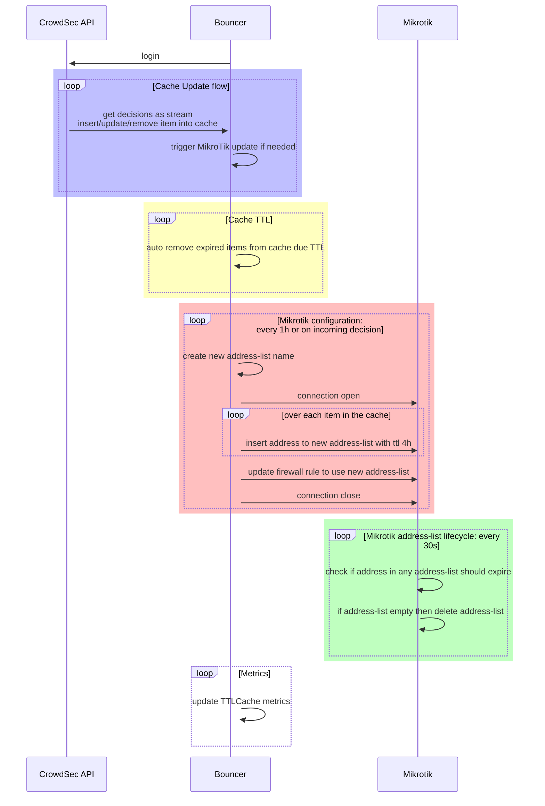
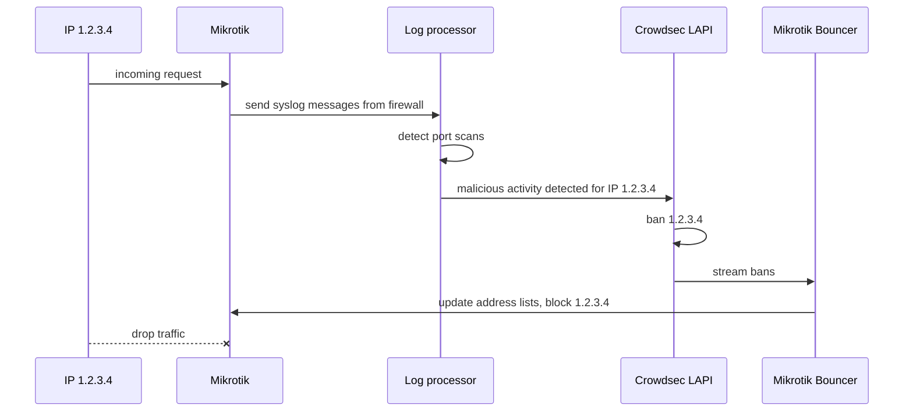
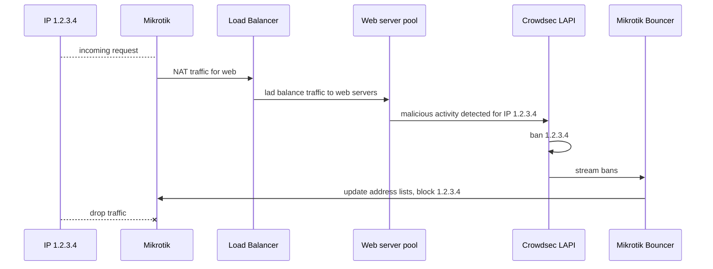
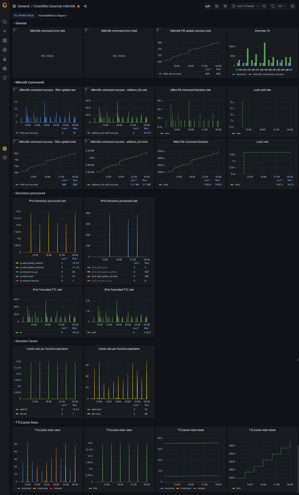
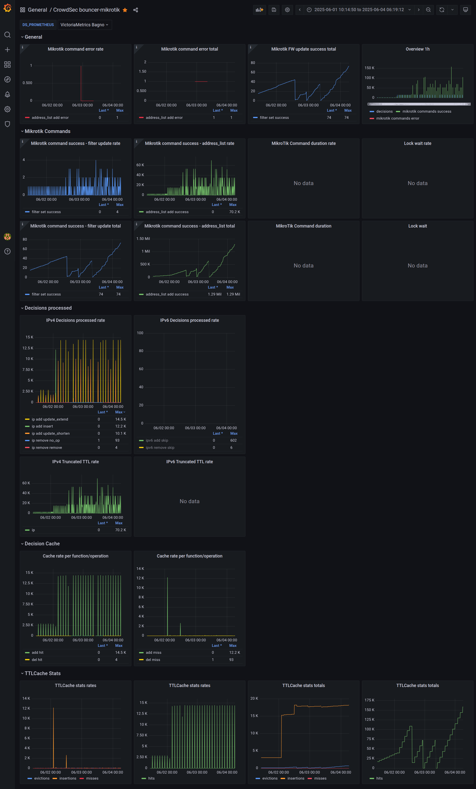

# CrowdSec MikroTik Bouncer Alternative


This project is not affiliated in any way with CrowdSec nor MikroTik,
use at your own risk.

This repository aims to implement the [MikroTik](https://mikrotik.com) router as
[CrowdSec](https://doc.crowdsec.net/) Remediation Component (formerly known as bouncer),
thus making it easier to block malicious IP to access your services.
For this it leverages [MikroTik API](https://mikrotik.com) to populate a dynamic Firewall Address List.

This started as a fork of `CrowdSec Bouncer for MikroTik RouterOS appliance` by [funkolabs](https://github.com/funkolab/cs-mikrotik-bouncer),
but now it is living as standalone project, named as `Alternative` (or in short `alt`),
to avoid confusion with the original repo and related integrations.

Notice it works differently, some elements are common in the config, so the migration is quite easy,
but make sure to read carefully this readme file for more details.

# Architecture

## App architecture



## Example appliances

### Processing syslog logs from MikroTik



### Blocking traffic at the edge



## Differences

Funkolabs version tries to dynamically update addresses in address lists on the
MikroTik device. This has some disadvantages:

- it fetches addresses from a single address-list from the routers,
  then used it as cache, meanwhile it was also listening to the decisions
  from the CrowdSec LAPI, and then tries to update the addresses in the MikroTik.
  So generally bouncer was doing a diff between upstream and MikroTik device,
  which is complex

- Doing `ip address find` on the MikroTik is slow, on certain devices this is
  **VERY** slow, making noticeable load on the CPU of the device

- above caused that some devices were not blocking addresses fast enough,
  or some addresses were not blocked at all, thus the diff process was
  lagging behind the main update loop until there was a noticeable desynchronization
  which could be solved only by the app restart

- some people mitigated it with scheduled app restarts after few hours,
  effectively making cache not really useful

- in addition it kept constant connections to the MikroTik device, I am not sure
  how it handled network errors - maybe crashes in containers helped it to
  auto recover :)

This fork works differently:

- there is no need to fetch addresses from the MikroTik device at all

- listen for the decisions from Crowdsec LAPI and compare it with local cache

- if there are differences between the cache such as add/delete/update
  then process the addresses

- in separate loop walk over addresses in local cache,
  and only then connect to the MikroTik device

- add address to a **NEW** address-list on the MikroTik,
  optionally prior inserting the address shorten expiry time to desired value
  to say 4h ( I named that as `truncate`) .

- if there were no errors then alter specific existing firewall rules to use
  that new address-list - the swap is quick and atomic

This way a new list it created on MikroTik device with addresses with updated
timeout values.

The old list will auto-expire after certain time, so it's good if this is short
living one say 4h - default basic CrowdSec configuration updates addresses
at least once per hour.

## Comparison to other tools

### Native CrowdSec and Mikrotik integration via API

As described at [docs integrations/mikrotik](https://docs.crowdsec.net/u/integrations/mikrotik/)
will be called `api-integration` below.

- `api-integration` requires MikroTik device to support ingesting blocklists.

- `api-integration` exposes list of currently blocked addresses only,
  and requires script on the MikroTik, wich will parse that imported blocklist.

- `api-integration` script on mikrotik first deletes existing addresses from
  address-list named `crowdsec-integration` and then inserts new entries
  Unfortunately address removal can be slow on certain devices.

- As of the current date (2025.07.06) only firewall filter is supported,
  anything else requires custom scripting.

See below for more details, which are shared with `crowdsecurity/cs-blocklist-mirror`.

### crowdsecurity/cs-blocklist-mirror

[cs-blocklist-mirror](https://github.com/crowdsecurity/cs-blocklist-mirror/tree/main/docker#mikrotik)

- `cs-blocklist-mirror` runs similarly to `api-integration` and requires
  MikroTik device to support ingesting blocklists and script on the device.

- `cs-blocklist-mirror` exposes web endpoint which allows to fetch address list
  and process it via script which runs on the MikroTik in scheduled intervals
  - this means that `cs-blocklist-mirror` runs let say once per hour.
  The script can be in plain ip address list (and custom scripting on MikroTik)
  or prepared script (golang template baked into the app).
  By default addresses are managed in single predefined address-list.
  Unfortunately address removal can be slow on certain devices.

- cs-mikrotik-bouncer-alt can run in scheduled intervals let say once per
  hour, just as tools above.

- cs-mikrotik-bouncer-alt can actively listen to the incoming streaming
  decisions from the CrowdSec LAPI and issue firewall update immediately, within
  seconds, and not minutes (depends on the config).

- cs-mikrotik-bouncer-alt creates new address list with active bans and then
  changes firewall rules to use new address list

- `cs-blocklist-mirror` can host single address list accessible from multiple devices
  at once, lists is in pull mode only

- cs-mikrotik-bouncer-alt manages single device in push mode,
  so each device needs separate running process (systemd service/container)
  to talk to remote MikroTik device.

## Features

- set max time for IP address blocking - new decision comes in for 6 days,
  but this tool changes it to a series of update 4h bans in MikroTik

- faster operation than other project, especially on older devices

- you can test it without affecting existing setup - creates new address-lists
  and updates specific firewall rules which can be disabled, thus easy to
  migrate from old to a new setup without breaking old configuration

- detailed messages in log, optionally plain text messages

- option to limit incoming decisions to desired value such as maximum 2 bans
  to process, to make it easier to test setups prior production

- separate loop to fetch decisions from the CrowdSec LAPI, which inserts
  addresses to the local cache

- separate loop to process addresses in the local cache and convert it to the
  commands to create new MikroTik address-list and firewall update command
  to use that newly created address-list

- use locking in the app to prevent concurrent address-list insertion within the
  process (if you use concurrent bouncers then this still may happen anyway)

- create connection to the MikroTik only if update is needed

- designed to run in container without any privileges, read only container

- allow specifying blocking on the `filter firewall` or `filter raw` rules.
  Using `filter raw` is faster and more performant, but it may not suit
  all scenarios, see below for more details.

- prometheus metrics, which allows you to use grafana dashboards





## Known limitations

- code executes commands against single MikroTik device, this is by design,
  and adding multi-device support is not planned due to the complexity.
  Just run separate app instances with different configs - this way you can
  much more easily test new configs on the same or different devices.
  The app eats very low amount of resources (about 10 miliCore/24MB in peak)

- incoming decisions are added to the cache in separate loop than items added
  to the Mikrotik, so there is a an about 10s delay between actual IP ban via
  `cscli` and the firewall update on the MikroTik device.

- there is no graceful shutdown,
  in worst case address-list is half populated but not applied to firewall,
  or applied only to for example IPv4 (or IPv6),
  so the old address list is still active, and when the new process spawns then
  it will create a new list anyway

### TODO

- maybe mkdocs + gh pages?

- try to run container on the mikrotik

- double check if there is an error after adding address, then if we try to
  update fw rule to new list:
  - if change to new list then it may be truncated ( missing entries)
  - if we keep to old list or don't add new list, then things can expire

- periodically ask MikroTik for `ip firewall address-list count-only` and make
  metric from it?

- [ko local](https://ko.build/configuration/)
  or `docker run -p 2112:2112 $(ko build ./cmd/app)` etc

- panic on no route to host in docker-compose up :D

## Running

For now, this service is mainly thought to be used in as an app in a container.
If you need to build from source, you can get some inspiration from the Makefile
or section below.

## Prerequisites

You should have a MikroTik appliance and a CrowdSec instance running.
The container is available as docker image under [quay.io/kaszpir/cs-mikrotik-bouncer-alt](https://quay.io/kaszpir/cs-mikrotik-bouncer-alt).
The running container must have access to CrowdSec and to MikroTik.

# Configuration

Read below instructions below doing anything.
First we configure MikroTik device by adding user and firewall rules.
Then we create a bouncer in CrowdSec.
After that prepare config for the bouncer and start the app or container.

## MikroTik config

### MikroTik user

Add user to MikroTik to allow access via RouterOS API.

```shell
/user add name=crowdsec-bouncer-user password=hunter2 group=full disabled=no
```

Remember to filter out access for the created user for given address only etc.

### Firewall - filter or raw

There is a difference between `firewall filter` and `firewall raw`, they serve
different purposes and require different computing powers - in short `filter`
is computationally heavier than `raw`, but allows doing more advanced traffic
filtering such as connection tracking and layer 7 protocol detection.

- raw drops packets as early as possible, and they are stateless
- raw is processed before filter rules, so it can save resources such as cpu
  and memory, especially if you are hitting device limits
- filter works after some other rules, like connection tracking
  and thus they are stateful and allow better manipulation of certain use cases
- using raw rules only should be done only when dealing with specific use cases
  such as DDOS (crowdsec is not really good at it, though)

Which one to choose?

- by default both are enabled, and first `raw` will drom most of the traffic,
  thus `filter` shoudl have much less to process and thus not consume that much
  resources if `raw` is not enabled.

- if the MikroTik device still struggles such as hitting limits of the cpu/memory
  of the device then try to use `raw` mode only.

### IPv6 firewall filter rules

For IPv6 - create IPv6 'drop' filter rules in `input` and `forward`
chain with the source address list set to `crowdsec` at the top.

Below are snippets to use, make sure to replace `ether1` with your desired interface.
Notice that if you use `place-before=0` then the order below is important,
and for `dst-address-list` we do not define interface.

```shell
/ipv6 firewall filter \
add action=drop dst-address-list=crowdsec chain=input \
place-before=0 comment="crowdsec input drop rules - dst"

/ipv6 firewall filter \
add action=drop dst-address-list=crowdsec chain=forward \
place-before=0 comment="crowdsec forward drop rules - dst"

/ipv6 firewall filter \
add action=drop src-address-list=crowdsec chain=input \
in-interface=ether1 \
place-before=0 comment="crowdsec input drop rules - src"

/ipv6 firewall filter \
add action=drop src-address-list=crowdsec chain=forward \
in-interface=ether1 \
place-before=0 comment="crowdsec forward drop rules - src"

```

The best would be to add them just after default `bad_ipv6` rules.

### IPv4 firewall rules

For IPv4 - create IP `drop` filter rules in `input` and `forward` chain with the
source address list set to `crowdsec` at the top or just before
generic packet counter rule.

Below are snippets to use, make sure to replace `ether1` with your desired interface,
assuming that rule 0 is a dummy passthrough for packet counting added by default
to MikroTik, and rule 1 is whatever but we want to insert CrowdSec before it.
Notice that if you use `place-before=1` then the order below is important,
and for `dst-address-list` we do not define interface.

```shell
/ip firewall filter \
add action=drop dst-address-list=crowdsec chain=input \
place-before=1 comment="crowdsec input drop rules - dst"

/ip firewall filter \
add action=drop dst-address-list=crowdsec chain=forward \
place-before=1 comment="crowdsec forward drop rules - dst"

/ip firewall filter \
add action=drop src-address-list=crowdsec chain=input \
in-interface=ether1 \
place-before=1 comment="crowdsec input drop rules - src"

/ip firewall filter \
add action=drop src-address-list=crowdsec chain=forward \
in-interface=ether1 \
place-before=1 comment="crowdsec forward drop rules - src"

```

### List firewall filter rules

Get the list of firewall rules which were added, this will be needed later.

```shell
/ip firewall filter print without-paging

/ipv6 firewall filter print without-paging
```

Write down numbers of the rules on the most left column.

For example for IPv4:

```text
> /ip firewall filter print without-paging

Flags: X - disabled, I - invalid; D - dynamic
 0  D ;;; special dummy rule to show fasttrack counters
      chain=forward action=passthrough

 1    ;;; crowdsec forward drop rules - src
      chain=forward action=drop src-address-list=crowdsec in-interface=ether1 log=no log-prefix=""

 2    ;;; crowdsec input drop rules - src
      chain=input action=drop src-address-list=crowdsec in-interface=ether1 log=no log-prefix=""

 3    ;;; crowdsec forward drop rules - dst
      chain=forward action=drop dst-address-list=crowdsec log=no log-prefix=""

 4    ;;; crowdsec input drop rules - dst
      chain=input action=drop dst-address-list=crowdsec log=no log-prefix=""

 5    ;;; defconf: accept established,related,untracked
      chain=input action=accept connection-state=established,related,untracked

 6    ;;; defconf: drop invalid
      chain=input action=drop connection-state=invalid

```

then:

- `IP_FIREWALL_FILTER_RULES_SRC` would be `1,2`
- `IP_FIREWALL_FILTER_RULES_DST` would be `3,4`

Similar, for IPv6:

```text
> /ipv6 firewall filter print without-paging
Flags: X - disabled, I - invalid; D - dynamic
 0    ;;; crowdsec input drop rules - src
      chain=input action=drop src-address-list=crowdsec in-interface=ether1 log=no log-prefix=""

 1    ;;; crowdsec forward drop rules - src
      chain=forward action=drop src-address-list=crowdsec in-interface=ether1 log=no log-prefix=""

 2    ;;; crowdsec input drop rules - dst
      chain=input action=drop log=no log-prefix=""

 3    ;;; crowdsec forward drop rules - dst
      chain=forward action=drop log=no log-prefix=""

 4    ;;; defconf: drop invalid
      chain=input action=drop connection-state=invalid

 5    ;;; defconf: accept established,related,untracked
      chain=input action=accept connection-state=established,related,untracked
```

then:

- `IPV6_FIREWALL_FILTER_RULES_SRC` would be `0,1`
- `IPV6_FIREWALL_FILTER_RULES_DST` would be `2,3`

### IPv6 firewall raw rules

For IPv6 - create IPv6 'drop' filter rules in `prerouting` and `output`
chain with the source/destination address list set to `crowdsec` at the top.

Below are snippets to use, make sure to replace `ether1` with your desired interface.
Notice that if you use `place-before=0` then the order below is important.

```shell
/ipv6 firewall raw \
add action=drop src-address-list=crowdsec chain=prerouting \
in-interface=ether1 \
comment="crowdsec prerouting drop rules - src"

/ipv6 firewall raw \
add action=drop dst-address-list=crowdsec chain=prerouting \
comment="crowdsec prerouting drop rules - dst"

/ipv6 firewall raw \
add action=drop dst-address-list=crowdsec chain=output \
comment="crowdsec output drop rules - dst"

```

The best would be to add them just after default `bad_ipv6` rules.

### IPv4 firewall raw rules

For IPv4 - create IP `drop` filter rules in `prerouting` and `output` chain with the
source/destination address list set to `crowdsec` at the top or just before
generic packet counter rule.

Below are snippets to use, make sure to replace `ether1` with your desired interface,
assuming that rule 0 is a dummy passthrough for packet counting added by default
to MikroTik, and rule 1 is whatever but we want to insert CrowdSec before it.
Notice that if you use `place-before=1` then the order below is important.

```shell
/ip firewall raw \
add action=drop src-address-list=crowdsec chain=prerouting \
in-interface=ether1 \
comment="crowdsec prerouting drop rules - src"

/ip firewall raw \
add action=drop dst-address-list=crowdsec chain=prerouting \
comment="crowdsec prerouting drop rules - dst"

/ip firewall raw \
add action=drop dst-address-list=crowdsec chain=output \
comment="crowdsec output drop rules - dst"

```

### List firewall raw rules

Get the list of firewall rules which were added, this will be needed later.

```shell
/ip firewall raw print without-paging

/ipv6 firewall raw print without-paging
```

Write down numbers of the rules on the most left column.

For example for IPv4:

```text
> /ip firewall raw print without-paging
Flags: X - disabled, I - invalid; D - dynamic
 0  D ;;; special dummy rule to show fasttrack counters
      chain=prerouting action=passthrough

 1    ;;; crowdsec prerouting drop rules - src
      chain=prerouting action=drop log=no log-prefix="" src-address-list=crowdsec_2025-07-06_12-50-38

 2    ;;; crowdsec output drop rules - dst
      chain=output action=drop log=no log-prefix="" dst-address-list=crowdsec_2025-07-06_12-50-38

 3    ;;; crowdsec prerouting drop rules - dst
      chain=prerouting action=drop log=no log-prefix="" dst-address-list=crowdsec

```

then:

- `IP_FIREWALL_RAW_RULES_DST` would be `2,3` (output,prerouting)
- `IP_FIREWALL_RAW_RULES_SRC` would be `1` (prerouting)

Similar, for IPv6:

```text
> /ipv6 firewall raw print without-paging
Flags: X - disabled, I - invalid; D - dynamic
 0    ;;; crowdsec prerouting drop rules - src
      chain=prerouting action=drop in-interface=ether1 src-address-list=crowdsec

 1    ;;; crowdsec prerouting drop rules - dst
      chain=prerouting action=drop dst-address-list=crowdsec

 2    ;;; crowdsec output drop rules - dst
      chain=output action=drop dst-address-list=crowdsec


```

then:

- `IPV6_FIREWALL_RAW_RULES_DST` would be `1,2` (output,prerouting)
- `IPV6_FIREWALL_RAW_RULES_SRC` would be `0` (prerouting)

### Testing if it works

To avoid unexpected issues it is advised to change the new rules to `passthrough`
so that you can see the number of packets that got through it.

Additional logging should help in checking if the setup works as expected.

If it works then change rules to `drop` one by one.

### Prepare config for the app

Copy `env.dist` as `.env` and edit its content

Generate a bouncer API key following [CrowdSec documentation](https://doc.crowdsec.net/docs/cscli/cscli_bouncers_add),
get a bouncer API key from your CrowdSec with a command

```shell
cscli bouncers add mikrotik-bouncer
```

Copy the API key printed. You **WILL NOT** be able the get it again.
Paste this API key as the value for bouncer environment variable `CROWDSEC_BOUNCER_API_KEY`

Adjust other variables in .env file as needed, especially host to MikroTik
device and CrowdSec endpoint. See section below.

# Deployment

Only Linux deployments were tested as golang binary or containers.

## Locally

Make sure to have a golang installed locally, edit `.env` file and then

```shell
export $(cat .env | xargs)
go run .

```

## Docker

I recommend using [docker-compose](./deploy/docker/docker-compose.yaml),
copy .env file there and start bouncer with `docker compose up` and investigate errors.

If you want to test observability then run

```shell
cd deploy/docker
docker compose -f docker-compose-stack.yaml up
```

and it will spawn minimal example of the bouncer, prometheus and grafana with an imported
dashboard.

- [bouncer](http://127.0.0.1:2112/metrics)
- [prometheus](http://127.0.0.1:9090)
- [grafana](http://127.0.0.1:3000) user:pass `admin:admin`

The dasboard is imported only on grafana start so you can trigger containre restart to reload
the symlinked dashboard.

## Kubernetes

Kustomization files in [kubernetes](./deploy/k8s/) via [kustomize](https://kustomize.io/)
with optional ServiceMonitor for automatic metric collections via Prometheus Operator.

I suggest to deploy a bouncer in a separate namespace for each target MikroTik device.

If needed change in ServiceMonitor relabelings if you want to distinguish bouncers
in grafana (not implemented yet in the dashboard)

```yaml
...
  endpoints:
    - port: metrics
      scheme: http
      interval: 10s
      path: /metrics
      relabelings:
        - targetLabel: device # label key
          replacement: hap-ax-3 # label value

```

# Configuration options

The bouncer configuration is made via environment variables:

- `CROWDSEC_BOUNCER_API_KEY` - default value: ``, required,
  CrowdSec bouncer API key required to be authorized to request local API.

- `CROWDSEC_URL` - default value: `http://crowdsec:8080/`, required,
  Host and port of CrowdSec LAPI agent.

- `CROWDSEC_ORIGINS` - default value: ``, optional,
  Space separated list of CrowdSec origins to filter from LAPI,
  in example `crowdsec cscli`.

- `DEBUG_DECISIONS_MAX` - default value: `-1`, optional,
  Set number of decisions to process at max, useful for debugging.
  Set to 3 to make things less spammy.

- `LOG_LEVEL` - default value: `1`, optional,
  Minimum log level for bouncer in [zerolog levels](https://pkg.go.dev/github.com/rs/zerolog#readme-leveled-logging)

- `LOG_FORMAT_JSON` - default value: `true`, optional,
  Use logs in JSON format, set to `false` for plain text zerolog format
  with key=value, useful only in certain debug sessions

- `MIKROTIK_HOST` - default value: ``, required,
  MikroTik device address to access RouterOS API ( `ip:port`)

- `MIKROTIK_USER` - default value: ``, required,
  Mikrotik device username to access RouterOS API

- `MIKROTIK_PASS` - default value: ``, required,
  Mikrotik device password to access RouterOS API

- `MIKROTIK_TLS` -  default value: `true`, optional,
  User TLS to connect to MikroTik API,

- `MIKROTIK_IPV4` - default value: `true`, optional,
  IPv4 support, set to `true` to enable processing IPv4 blocklists

- `MIKROTIK_IPV6` - default value: `true`,  optional,
  IPv6 support, set to `true` to enable processing IPv6 blocklists

- `MIKROTIK_FIREWALL_FILTER_ENABLE` - default value: `true`, optional,
  enable updating firewall filter rules (filter input, forward, output)

- `IP_FIREWALL_FILTER_RULES_SRC` - default value: ``, required if `MIKROTIK_IPV4` is set to true,
  comma separated numbers of IPv4 firewall filter rules to update on access-list change,
  and to set src-address-list in it,
  those are created during configuration, for example `1,2` (filter input, forward, output)

- `IP_FIREWALL_FILTER_RULES_DST` - default value: ``, required if `MIKROTIK_IPV4` is set to true,
  comma separated numbers of IPv4 firewall filter rules to update on access-list change,
  and to set dst-address-list in it,
  those are created during configuration, for example `3,4` (filter input, forward, output)

- `IPV6_FIREWALL_FILTER_RULES_SRC` - default value: ``, required if `MIKROTIK_IPV6` is set to true,
  comma separated numbers of IPv6 firewall filter rules to update on access-list change,
  and to set src-address-list in it,
  those are created during configuration , for example `0,1` (filter input, forward, output)

- `IPV6_FIREWALL_FILTER_RULES_DST` - default value: ``, required if `MIKROTIK_IPV6` is set to true,
  comma separated numbers of IPv6 firewall filter rules to update on access-list change,
  and to set dst-address-list in it,
  those are created during configuration , for example `2,3` (filter input, forward, output)

- `MIKROTIK_FIREWALL_RAW_ENABLE` - default value: `true`, optional,
  enable updating firewall raw rules (raw prerouting, output)

- `IP_FIREWALL_RAW_RULES_SRC` - default value: ``, required if `MIKROTIK_IPV4` is set to true,
  comma separated numbers of IPv4 firewall raw rules to update on access-list change,
  and to set src-address-list in it,
  those are created during configuration, for example `1` (raw prerouting, output)

- `IP_FIREWALL_RAW_RULES_DST` - default value: ``, required if `MIKROTIK_IPV4` is set to true,
  comma separated numbers of IPv4 firewall raw rules to update on access-list change,
  and to set dst-address-list in it,
  those are created during configuration, for example `2` (raw prerouting, output)

- `IPV6_FIREWALL_RAW_RULES_SRC` - default value: ``, required if `MIKROTIK_IPV6` is set to true,
  comma separated numbers of IPv6 firewall raw rules to update on access-list change,
  and to set src-address-list in it,
  those are created during configuration , for example `0` (raw prerouting, output)

- `IPV6_FIREWALL_RAW_RULES_DST` - default value: ``, required if `MIKROTIK_IPV6` is set to true,
  comma separated numbers of IPv6 firewall raw rules to update on access-list change,
  and to set dst-address-list in it,
  those are created during configuration , for example `1` (raw prerouting, output)

- `MIKROTIK_ADDRESS_LIST` - default value: `crowdsec`, optional,
  prefix for target address-list in MikroTik device, no special chars,
  no spaces etc, generated name will be with a timestamp suffix,
  if you set it to `crowdsec` then access-list will be named as
  `crowdsec_2025-05-19_15-01-09` or something like it (local time),

- `MIKROTIK_TIMEOUT` - default value: `10s`, optional,
  set timeout when trying to connect to the MikroTik,
  recommended to keep it under `60s`

- `MIKROTIK_UPDATE_FREQUENCY` - default value: `1h`, optional,
  Set default frequency to update MikroTik address-lists and firewall rules.

  This is useful if you have disabled `TRIGGER_ON_UPDATE`,
  or enabled `USE_MAX_TTL=true` and set `DEFAULT_TTL_MAX`.

- `USE_MAX_TTL` - default value: `false`, optional,
  Set to `true` if you want to truncate timeout for the address in address-list
  so that your address lists expire faster

- `DEFAULT_TTL_MAX` - default value: `24h`, optional,
  If USE_MAX_TTL is `true`  and new address timeout is above `DEFAULT_TTL_MAX`
  then that address will have timeout set to `USE_MAX_TTL` value.

  For example new decision comes in, and address should be banned for 4 days,
  but `DEFAULT_TTL_MAX=4h` will make it to be added with `timeout=4h`.
  Notice that the original 4 day ban will be respected in the application cache
  or from incoming CrowdSec decisions, but on MikroTik it will have 4h.

  Yet it is good to quickly expire old address-lists automatically, because
  new ones will come in with refreshed entries for the same address IPs to block.

  Because CrowdSec publishes new lists at least once an hour then that address
  will be readded to the new list every hour until expires.

  This helps to avoid having thousands addresses in hundreds address-lists in
  the MikroTik.

  Recommended value is at least 2x longer than the frequency you get updates from
  the CrowdSec, so on basic setup 4h should be sufficient. For locations with
  possible network disruptions 8h or 16 would be recommended
  (but then why ban if there is no internet? :) ).

  For weaker/older devices it may be better to keep it really low like 2h.

  Must be longer than `MIKROTIK_UPDATE_FREQUENCY`.

- `TRIGGER_ON_UPDATE` - default value: `true`, optional,
  if you set it to true, then trigger MikroTik address-list and firewall update
  immediately (look at `TICKER_INTERVAL` below).

  This makes ban added from other tools being applied faster, but for the
  price of creating new address-list and firewall update.
  Effectively you really want this enabled, and also have `USE_MAX_TTL` set to
  say 4h for quicker old address expiration.

  If set to `false` then the address will not be banned until the next loop
  of the `MIKROTIK_UPDATE_FREQUENCY` is executed, so on default settings it may
  take up to 1h before address is banned.

- `TICKER_INTERVAL` - default value: `10s`, optional
  how frequently process streamed decisions from CrowdSec LAPI,

  Notice this is a golang [time.Duration](https://pkg.go.dev/time#Duration)
  format, but the value cannot be equal or less than `0s`.

  This will vary depending on the current length of the IP addresses
  to be blocked - so for example if you test with 4k addresses inserted and it
  takes 10s then adding 20k addresses may take more (let say 25s).

  The best if this is the total time used to update MikroTik
  address lists and firewall plus about 30% just to prevent bouncer stuck waiting
  to acquire lock for the update.

  If you get frequent delays in acquiring lock then try to increase this value
  higher, certain devices are quite slow and they need at least `30s` or `60s`
  for processing.

  Sometimes it is just better to buy better faster hardware.

- `GOMAXPROCS` - default value: `` (automatic number of processors), optional,
  Set default processes to use by golang app, especially useful to prevent it
  from getting excessively throttled in the containers,
  Recommended value `1`.

- `METRICS_ADDRESS` - default value: `:2112`, optional,
  Address to use to start metrics server in Prometheus format, metrics are
  exposed under `/metrics` path, without authorization (not implemented).

- `TZ` - default value: ``, optional,
  set desired timezone, otherwise if empty then it will take local time from
  the machine it runs on. It affects logging and name of the address-list
  suffix created on the MikroTik device. Example `UTC` or `Europe/Warsaw`.

# Metrics

If running locally see [http://127.0.0.1:2112/metrics](http://127.0.0.1:2112/metrics)

Some metrics appear after a while.

[Grafana dashboard](./observability/grafana/CrowdSec_bouncer-mikrotik.json)

Most important ones:

- `mikrotik_cmd_total{result="error"}` - number of errors when trying to communicate with MikroTik

- `mikrotik_cmd_total{result="success"}` - number of commands successfully executed on MikroTik

- `decisions_total{}` - processed incoming CrowdSec decisions to block/unblock addresses

- `truncated_ttl_total{}` - number of ban truncated because they were too long

- `mikrotik_cmd_duration_total` - duration of the commands executed when doing an update,
  for example when using HAP AX3 this should usually be about 10 to 15 seconds per update
  for inserting about 20.000 addresses to a new address-list

- `lock_wait_duration_total` - time spent for waiting for the lock to run commands to update
  a Mikrotik device, in general this should be microseconds, unless there is an existing update
  and there is a lot of decisions to be processed, usually if this takes few seconds
  few times per hour then it is okay, but if you get few seconds constantly then
  you may need to check how many addresses are added to the address-list,
  shorten default ttl to an hour to prevent massive number of addresses in address lists
  or upgrade hardware. Another option would be to implement different update mechanism,
  so make a new issue on GitHub.

# Contribution

For bigger changes please create an issue for discussion.
This helps in deciding if your work is worth doing because it may not be accepted,
due to various reasons.

Feel free to maintain your own fork :)

## Local Development

copy `env.dist` as `.env` and edit its values, then run:

```shell
export $(cat .env | xargs)
go run .

```

or if you want to also get the logs:

```shell
export $(cat .env | xargs)
go run . 2>&1| tee  out-$(date +"%Y-%m-%d_%H-%M").log
```

Build binary:

```shell
make binary
```

Build image using [ko](https://ko.build/):

```shell
export KO_DOCKER_REPO=quay.io/kaszpir/
make image
# edit deploy/docker/docker-compose.yaml such as image/tag
docker-compose up
```

## Other MikroTik commands

```shell
/ip firewall address-list remove [find where list="crowdsec"]
/ipv6 firewall address-list remove [find where list="crowdsec"]

# drop specific matching crowdsec prefix for given day
/ip firewall address-list remove [find where list~"^crowdsec_2025-05-20_.*"]
/ipv6 firewall address-list remove [find where list~"^crowdsec_2025-05-20_.*"]


# drop all matching crowdsec prefix
/ip firewall address-list remove [find where list~"^crowdsec.*"]
/ipv6 firewall address-list remove [find where list~"^crowdsec.*"]

# list ALL addresses in address-list, meaning any ip in address lists,
# public addresses for lan/wan etc
/ip firewall address-list print count-only
/ipv6 firewall address-list print count-only

# list ip in given address list (slow, memory/cpu intensive)
/ip firewall address-list print brief without-paging   where list=crowdsec_2025-07-06_17-02-24

# show just count of the ip addresses in given address list (slow, memory/cpu intensive)
/ip firewall address-list print brief without-paging  count-only where list=crowdsec_2025-07-06_17-02-24
```

## Release

### Preparation

- before release run `make image` locally, will build and push image to quay
- test image for few hours.

### Actual Release

- merge to master/main
- push tag - will trigger github action of building image
- prepare github release with details, especially about breaking changes
