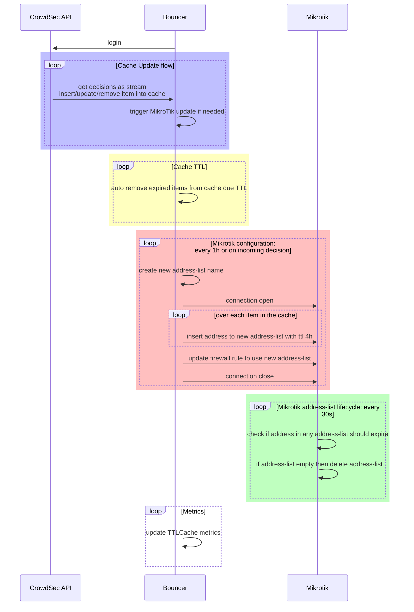
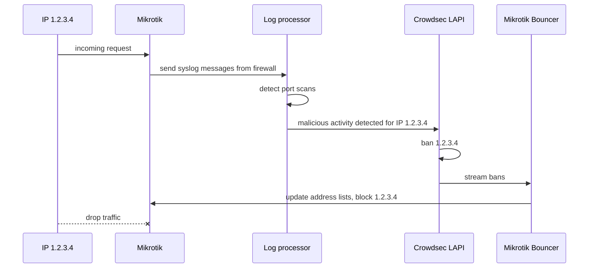
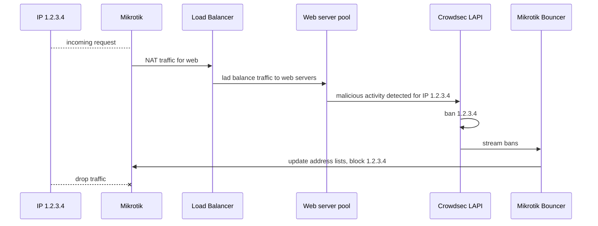

# CrowdSec MikroTik Bouncer Alternative

## Disclaimer

This project is not affiliated in any way with CrowdSec nor MikroTik,
use at your own risk.

## About

This repository aims to implement the [MikroTik](https://mikrotik.com) router as
[CrowdSec](https://doc.crowdsec.net/) Remediation Component (formerly known as bouncer),
thus making it easier to block malicious IP to access your services.
For this it leverages [MikroTik API](https://mikrotik.com) to populate a dynamic Firewall Address List.

This started as a fork of `CrowdSec Bouncer for MikroTik RouterOS appliance` by [funkolabs](https://github.com/funkolab/cs-mikrotik-bouncer),
but now it is living as standalone project, named as `Alternative` (or in short `alt`),
to avoid confusion with the original repo and related integrations.

Notice it works differently, some elements are common in the config, so the migration is quite easy,
but make sure to read carefully this readme file for more details.

## Architecture

### App architecture

## Example appliances

### Processing syslog logs from MikroTik

### Blocking traffic at the edge

